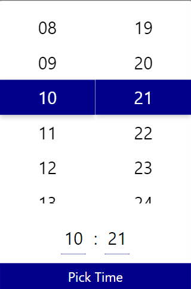
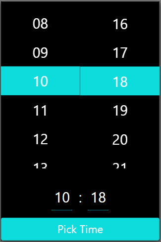

# NgxRSTimePicker
This is a simple Angular Time Picker

## Available Inputs:
* pickTimeText - Text of pick time button
* date - Date object for setting hour and time
* primaryColor - Color of the selected hour, minute, and the pick time background color
* backgroundColor - Time Picker container background color
* textColor - Text Color (Digits etc.)
* inputControlBackgroundColor - Hour and Minutes input background color
* width - Container width
* manualInput - Toggle display manual input
* maxHours - Max hours (apply custom max number for hours)

## Installation
* Bootstrap is required `npm i Boostrap`
* `npm i ngx-rs-time-picker`

### Demo
https://rs-time-picker-demo.firebaseapp.com/

### Created By RSinnotech Team
Visit us at: www.rsinnotech.com
